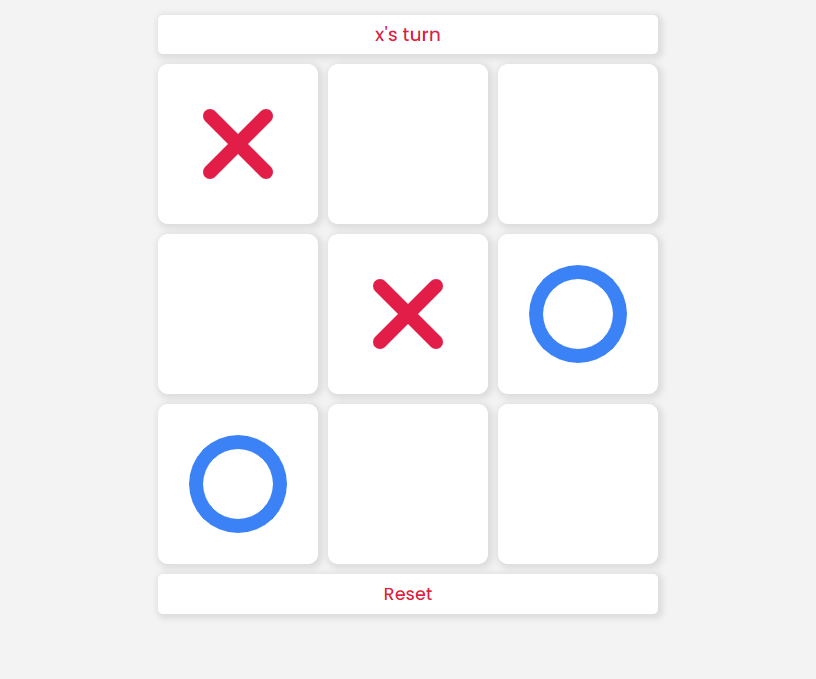
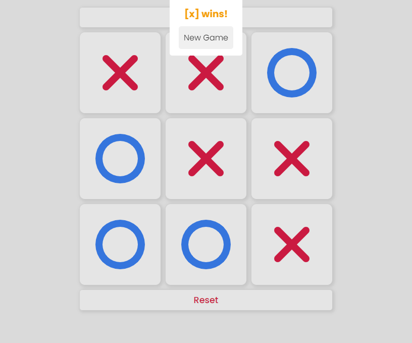
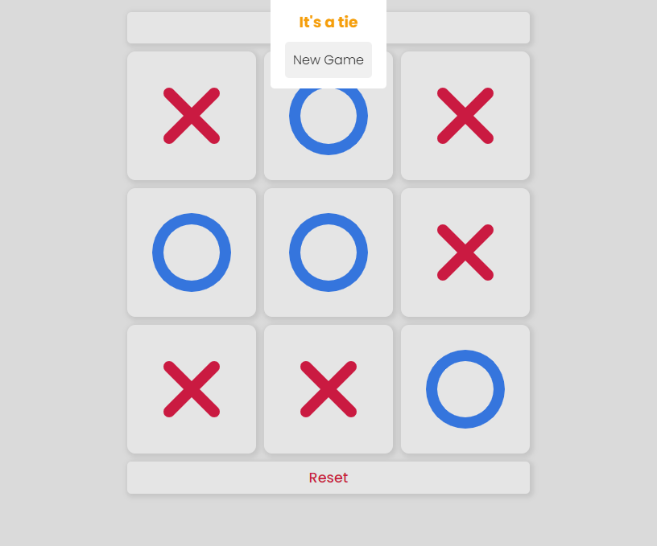

# Odin Tic-tac-toe game

- This project represents a web-based tic-tac-toe game

## Previews

- Default game board screenshot

- Win game board screenshot

- Tie game board screenshot

## Features

- The player is able to tab one of the nine spots on the game board to play, whoever get 3 same markers in a row is the winner
- The player is able to start a new game by clicking reset button

## Contact

Maintainer - [Minh Hoang](mailto:nguyenbahoangminh06@gmail.com)
